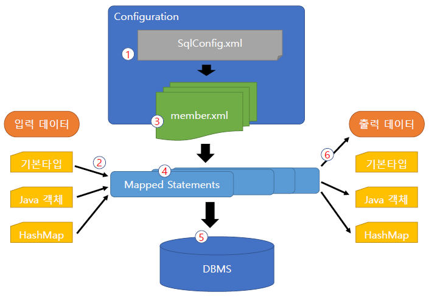

# MyBatis의 특징
* SQL문의 일반적인 실행 방법
  - SQL문을 문자열입력 => 실행
  - SQL문의 복잡성이 늘어남에 따라 유지보수가 어려워짐

* MyBatis 프레임워크는 자바코드와 SQL 문을 분리해서 가독성을 높이고 사용 및 유지 보수를 편리하게 한다.

* 특징
  - SQL 실행 결과를 자바빈즈 또는 Map 객체에 매핑해주는 Persistence
솔루션으로 관리함 즉, SQL 을 소스코드가 아닌 XML로 분리
  - SQL과 프로그래밍 코드를 분리해서 구현
  - 데이터 소스기능과 트랜젝션 처리 기능을 제공

* 절차
  1) SqlMapConfig.xml에 각 기능별 실행할 SQL 문을 sqlMap.xml 에 미리 작성한 후 등록
  2) 애플리케이션에서 데이터베이스와 연동하는 데 필요한 데이터를 각각의 매개변수에 저장한 후 마이바티스에 전달
  3) 애플리케이션에서 요청한 SQL 문을 SqlMap.xml 에서 선택
  4) 전달한 매개변수와 선택한 SQL 결합
  5) 매개변수와 결합된 SQL 문을 DBMS 에서 실행
  6) DBMS에서 반환된 데이터를 애플리케이션에서 제공하는 적당한 매개변수에 저장한 후 반환  
  <br>



* 기본적인 서블릿/JSP 프로그램에서 MyBatis를 적용 해보면 아래와 같은 2개의 설정파일을 만들어주고, DAO와 servlet을 작성해준다.
  - config.xml
    ```xml
    <properties resource="com/green/db/db.properties" />
	
    <typeAliases>
      <typeAlias type="com.green.vo.MemberVO" alias="memVo"/>
    </typeAliases>

    <environments default="development">
      <environment id="development">
        <transactionManager type="JDBC"/>
        <dataSource type="POOLED">
          <property name="driver" value="${driver}"/>
          <property name="url" value="${jdbcUrl}"/>
          <property name="username" value="${user}"/>
          <property name="password" value="${password}"/>
        </dataSource>
      </environment>
    </environments>
    <mappers>
      <mapper resource="com/green/mybatis/mapper/member.xml"/>
    </mappers>
    ```

  - Mapper.xml
    ```xml
    <?xml version="1.0" encoding="UTF-8" ?>
    <!DOCTYPE mapper
      PUBLIC "-//mybatis.org//DTD Mapper 3.0//EN"
      "http://mybatis.org/dtd/mybatis-3-mapper.dtd">
    <mapper namespace="com.green.mapper.member">
      
        <resultMap type="memVo" id="mVo"><!-- 수동으로 컬럼과 자바객체를 매핑 -->
          <result column="id" property="id" />
          <result column="name" property="name" />
          <result column="email" property="email" />
          <result column="password" property="password" />
          <result column="regDate" property="registerDate" />
        </resultMap>
        
      <!-- <select id="selectAll" resultType="memVo"> -->
      <select id="selectAll" resultMap="mVo">
        SELECT * FROM members
        ORDER BY id DESC
      </select>
      
      <select id="selectCnt" resultType="int">
        SELECT count(*) FROM members
      </select>
      
      <select id="selectByEmail" resultMap="mVo" parameterType="String">
        SELECT * FROM members
        WHERE email=#{email}
      </select>
      
      <insert id="insertMember" parameterType="memVo">
        INSERT INTO members
        VALUES(members_seq.nextval, #{email}, #{password}, #{name}, sysdate)
      </insert>
      
      <update id="updateMember" parameterType="memVo">
        UPDATE members SET name=#{name}, password=#{password}
        WHERE email=#{email}
      </update>
      
      <delete id="deleteMember" parameterType="String">
        DELETE FROM members
        WHERE email=#{email}
      </delete>
      
    </mapper>
    ``` 
  
  - MemberDao2.java
    ```java
    package com.green.dao;

    import java.io.IOException;
    import java.io.InputStream;
    import java.util.List;

    import org.apache.ibatis.io.Resources;
    import org.apache.ibatis.session.SqlSession;
    import org.apache.ibatis.session.SqlSessionFactory;
    import org.apache.ibatis.session.SqlSessionFactoryBuilder;

    import com.green.vo.MemberVO;

    public class MemberDAO2 {	// mybatis 설정을 읽어서 DB에 접속할 DAO
      
      private MemberDAO2() {}
      
      private static MemberDAO2 dao = new MemberDAO2();
      
      public static MemberDAO2 getInstance() {
        return dao;
      }

      // 마이바티스를 사용하려면 SqlSessionFactory 객체를 빌드해야 한다.
      private static SqlSessionFactory sqlMapper = null;
      
      private static SqlSessionFactory getFactory() {
        if(sqlMapper == null) {
          try {
            String resource = "com/green/mybatis/mybatisConfig.xml";
            InputStream inputStream = Resources.getResourceAsStream(resource);
            sqlMapper = new SqlSessionFactoryBuilder().build(inputStream);
          } catch (IOException e) {
            e.printStackTrace();
          }
        }
        
        return sqlMapper;
      }
      
      // 마이바티스를 이용해 회원 조회
      public List<MemberVO> selectAll() {
        List<MemberVO> lists = null;
        
        sqlMapper = getFactory();
        SqlSession session = sqlMapper.openSession();
        lists = session.selectList("com.green.mapper.member.selectAll");
        
        return lists;
      }
      
      // 마이바티스를 이용해 회원수 조회
      public int selectCnt() {
        int cnt = 0;
        
        sqlMapper = getFactory();
        SqlSession session = sqlMapper.openSession();
        cnt = session.selectOne("com.green.mapper.member.selectCnt");
        
        return cnt;
      }
      
      // 마이바티스를 이용해 회원을 이메일로 조회
      public MemberVO selectByEmail(String email) {
        MemberVO mVo = null;
        
        sqlMapper = getFactory();
        SqlSession session = sqlMapper.openSession();
        mVo = session.selectOne("com.green.mapper.member.selectByEmail", email);
        
        return mVo;
      }
      
      // 마이바티스를 이용해 회원 등록
      public int insertMember(MemberVO mVo) {
        
        sqlMapper = getFactory();
        SqlSession session = sqlMapper.openSession();
        
        int num = session.insert("com.green.mapper.member.insertMember", mVo);
        session.commit();
        
        return num;
      }
      
      // 마이바티스를 이용해 회원 수정
      public int updateMember(MemberVO mVo) {

        sqlMapper = getFactory();
        SqlSession session = sqlMapper.openSession();
        
        int num = session.update("com.green.mapper.member.updateMember", mVo);
        session.commit();
        
        return num;
      }
        
      // 마이바티스를 이용해 회원 삭제
      public int deleteMember(String email) {

        sqlMapper = getFactory();
        SqlSession session = sqlMapper.openSession();
        
        int num = session.delete("com.green.mapper.member.deleteMember", email);
        session.commit();
        
        return num;
      }
    }
    ```
  
  - FirstServlet.java
    ```java
    protected void doGet(HttpServletRequest request, HttpServletResponse response) throws ServletException, IOException {
      String url = "member/lists.jsp";
      // 마이바티스를 사용하지 않은 예제
      // MemberDAO1 dao = MemberDAO1.getInstance();
      
      // 마이바티스를 사용한 예제
      MemberDAO2 dao = MemberDAO2.getInstance();
      List<MemberVO> lists = dao.selectAll();
      request.setAttribute("lists", lists);
      
      request.getRequestDispatcher(url).forward(request, response);
    }

    protected void doPost(HttpServletRequest request, HttpServletResponse response) throws ServletException, IOException {
      doGet(request, response);
    }
    ```

* 만들어진 설정파일을 읽어와서 SqlSessionFactory를 빌드해야 한다.

* 빌드된 SqlSessionFactory객체를 통해 SqlSession객체를 얻어오고 이를 통해 Mapper에 미리 작성된 쿼리를 실행함으로 데이터베이스에 접근한다.

* DAO를 생성시 MyBatis는 수동 커밋을 해주어야 한다.

* MyBatis의 강점은 단순히 SQL쿼리와 Java코드간의 분리가 아니다.

* 기존SQL쿼리의 재사용성이 강점이다.
  - 예시
    + SELECT * FROM member
    + SELECT * FROM member WHERE email='email';
    + SELECT * FROM member WHERE name='name';
  - 공통의 SQL문에 조건값의 유무에 따라 동적으로 SQL문에 조건절 추가한다.

  ```xml
  <sql id="sel">
  		SELECT * FROM members
  	</sql>
  	
	<select id="selectAll" resultMap="mVo">
		<!-- SELECT * FROM members -->
		<include refid="sel" />
		ORDER BY id DESC
	</select>
  ```
* 동적 쿼리 생성에 사용되는 태그요소
  - if, choose, trim, foreach~~
  
  - mapper.xml에 작성
    ```xml
    <!-- 동적 SQL문 생성 : IF -->
    <select id="selectMember" resultType="mVo" parameterType="memVo">
      SELECT * FROM members
      
      <where>
        <if test="email != '' and email != null">
          email = #{email}	<!-- SELECT * FROM members WHERE email = #{email} -->
        </if>
        <if test="name != '' and name != null">
          name = #{name}		<!-- SELECT * FROM members WHERE name = #{name} -->
        </if>
        <!-- else if는 없고 둘다 true라면 SELECT * FROM members WHERE email = #{email} AND name = #{name}으로 조회 -->
      </where>
    </select>

    <!-- 동적 SQL문 생성 : CHOOSE -->
    <select id="selectMemberChoose" resultMap="mVo" parameterType="memVo">
      SELECT * FROM members
      
      <where>
        <choose>
          <when test="email != '' and email != null and name != '' and name != null">
            email = #{email} AND name = #{name}
          </when>
          <!-- if와 다르게 choose when은 앞에가 false일때만 뒤로 넘어온다. -->
          <when test="email != '' and email != null">
            email = #{email}
          </when>
          <when test="name != '' and name != null">
            name = #{name}
          </when>
        </choose>
      </where>
      ORDER BY id ASC
    </select>

    <!-- 동적 SQL문 생성 : ForEach -->
    <!-- 
      <foreach item="item" collection="list" index="index" open="(" close=")" separator=",">
        #{item}
      </foreach>
      
      collection => 전달받은 것이 배열(array) 또는 리스트(list)
      index => 순서 번호 0부터 시작
      item => 리스트로 부터 꺼내진 하나의 데이터
      
      open : 구문이 시작될때 지정한 기호 추가
      close : 구문이 끝날때 지정한 기호 추가
      separator : 한번 이상 반복되는 경우 지정한 기호 추가
      
      WHERE score between 50 and 70 => 연속적인값
      WHERE name IN ('김길동','고길동','조길동') => 불연속적인 값
    -->
    
    <select id="forEachSearch" resultMap="mVo" parameterType="java.util.list">
      SELECT * FROM members
      WHERE name IN
      <foreach collection="list" item="item" open="(" close=")" separator=",">
        #{item}
      </foreach>
      ORDER BY id ASC
    </select>
    ```

  - DAO 작성
    ```java
    // 이메일 그리고 이름으로 회원 정보 조회
	  public List<MemberVO> searchMember(MemberVO mVo){
      List<MemberVO> list = null;
      
      sqlMapper = getFactory();
      SqlSession session = sqlMapper.openSession();
      
      //list = session.selectList("com.green.mapper.member.selectMember", mVo);
      list = session.selectList("com.green.mapper.member.selectMemberChoose", mVo);
      
      return list;
    }
    
    // 여러명의 이름으로 검색
    public List<MemberVO> foreachSearchMember(List<String> names){
      List<MemberVO> list = null;
      
      sqlMapper = getFactory();
      SqlSession session = sqlMapper.openSession();
      
      list = session.selectList("com.green.mapper.member.forEachSearch", names);
      
      return list;
    }
    ```
