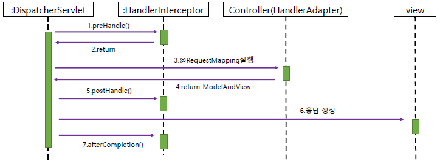

## &lt;spring:message&gt; 태그로 메시지 출력하기
* 사용자 화면에 보여질 문자열은 보통 JSP 코드에 직접 넣는 것이 일반적이다.

* 그러나 문자열을 변경하고 싶을 때, 또는 다국어 지원이 필요할 때 해당 문자열을 언어에 알맞게 변경해 표시 해주어야 하는데 이때 하드 코딩이 되어있다면 언어별로 별도의 뷰를 만들어야 하는 상황도 생길수 있다.

* 이런 상황을 해결하기 위한 가장 좋은 방법은 뷰 코드에서 사용할 문자열을 별도의 파일로 보관하고 언어에 따라 알맞은 문자열을 읽어와서 출력하는 것이다.

* 스프링은 자체적으로 이런 기능을 제공한다.

* 문자열을 별도의 파일에 작성하고 JSP 코드에서 이를 사용하려면 다음의 작업을 한다.
  - 메시지 파일을 작성 (.properties)
  - 메시지 파일에서 값을 읽어오는 MessageSource 빈 을 설정
  - JSP코드에서 &lt;spring:message&gt; 태그를 사용해서 메시지를 출력

* 메시지 파일을 작성 (.properties) : label.properties
    ```
    member.register=회원가입

    term=약관
    term.content=약관 내용
    term.agree=동의
    next.btn=다음단계

    member.info=회원 정보
    email=이메일
    name=이름
    password=비밀번호
    password.confirm=비밀번호 확인
    register.btn=가입 완료

    register.done=회원 가입을 완료했습니다.

    go.main=메인으로 이동
    ```

* 메시지 파일에서 값을 읽어오는 MessageSource 빈 을 설정 : spring-mvc.xml 에 추가
    ```xml
    <!-- JSP 라벨 추가 -->
	<bean id="messageSource" class="org.springframework.context.support.ReloadableResourceBundleMessageSource">
		<property name="basenames">
			<list>
				<value>classpath:message/label</value>
                <!-- 파일이 2개 이상이면 value를 추가해준다. -->
			</list>
		</property>
		<property name="defaultEncoding" value="UTF-8" />
	</bean>
    ```

* JSP 코드에서 spring:message 태그를 사용해서 메시지를 출력
    ```html
    <title><spring:message code="member.register" /></title>
    </head>
    <body>
        <h2><spring:message code="term" /></h2>
        <p><spring:message code="term.content" /></p>
        <form action="step2" method="post">
            <label>
                <input type="checkbox" name="agree" value="true"> <spring:message code="term.agree" />
            </label>
            <input type="submit" value="<spring:message code='next.btn' />">
        </form>
    </body>
    ```

## 커맨드 객체의 값 검증과 에러 메시지 처리
* 기존에는 자바스크립트로 처리했고 실제로도 자바스크립트로 많이 처리하지만 spring에서 처리하는 방법도 있다.

* 회원 가입처리 부분의 코드에서 정상적이지 않은 값을 입력해도 정상적으로 동작하는 문제가 있었다.

* 올바르지 않은 이메일을 입력하거나, 이름을 생략해도 가입이 가능하다.  
=> 입력값 검증이 없다.

* 또는 중복된 이메일 주소를 입력해서 가입이 실패 한 경우 사용자에게 가입 실패의 원인을 알려주지 않아 사용자는 혼란을 겪게 된다.  
=> 에러 메시지 처리

* 스프링에는 두가지 문제를 처리하기 위해 다음과 같은 방법을 제공한다.
  - 커맨드 객체를 검증하고 결과를 에러 코드로 저장
  - JSP에서 에러 코드로부터 메시지 출력

* 커맨드 객체 검증과 에러 코드 지정하기

* 커맨드 객체의 값이 올바른지 검사하려면 다음 두 인터페이스를 사용한다.
  - org.springframework.validation.Validator
  - org.springframework.validation.Errors

* support메서드는 Validator가 검증할 수 있는 타입인자인지 검사 목적으로 사용

* validate메서드는 첫 번째로 받은 객체를 검증하고 그 결과를 Errors 에 담는 기능을 정의한다.

* spring.validator.RegisterRequestValidator.java 작성
    ```java
    public class RegisterRequestValidator implements Validator {

	// 파라미터로 전달받은 객체가 RegisterRequest로 변환 가능한지 확인하는 메서드 
	@Override
	public boolean supports(Class<?> clazz) {
		return RegisterRequest.class.isAssignableFrom(clazz);
	}
    
	private static final String emailExp = "^[0-9a-zA-Z]([-_.]?[0-9a-zA-Z])*@[0-9a-zA-Z]([-_.]?[0-9a-zA-Z])*.[a-zA-Z]{2,3}$";
	
	private Pattern pattern = Pattern.compile(emailExp);
	
	// 검증 하는 메서드 오버라이드
	@Override
	public void validate(Object target, Errors errors) {	// target : 검사 대상 객체, errors : 검사 결과 에러 코드
		// 검사 대상 객체의 특정 프로퍼티의 값이나 상태등이 올바른지 체크하고 값이 올바르지 않다면 errors에 에러코드를 저장
		RegisterRequest regReq = (RegisterRequest)target;
		// 위에서 형변환 가능한지 확인하는 메서드를 만들었기 때문에 형변환 가능여부 확인은 따로 하지 않는다.

        // regReq의 email값이 없으면 에러메세지
		if(regReq.getEmail()==null || regReq.getEmail().trim().isEmpty()) {
			errors.rejectValue("email", "required");
		} else {	// 비어있지 않다면 형식을 체크한다. 정규식을 활용
			Matcher matcher = pattern.matcher(regReq.getEmail());
			if(!matcher.matches()) { // true : 정규식 일치 / false : 정규식 불일치
				errors.rejectValue("email", "badMatch");
			}
		}

        // ValidationUtils객체는 자주 사용되는 값 검증 코드를 메서드 한 것
		// 위와 같이 name값이 비어있거나 공백이면 에러메세지를 담아주는 메서드가 있다.
		ValidationUtils.rejectIfEmptyOrWhitespace(errors, "name", "required");
		// 공밲까진 허용
		ValidationUtils.rejectIfEmpty(errors, "password", "required");
		ValidationUtils.rejectIfEmpty(errors, "confirmPassword", "required");
		
		// 비밀번호와 비밀번호 확인이 일치 하는가?
		if(!regReq.getPassword().isEmpty()) {
			if(!regReq.isPasswordEqualConfirmPassword()) {
				errors.rejectValue("confirmPassword", "nomatch");
			}
		}
    }
    }
    ```
* RegisterController.java 변경
    ```java
    @PostMapping("/step3")
	public String handlerStep3(@ModelAttribute("formData")RegisterRequest regReq, Errors err) {
		
		// 커멘드 객체 값을 검증
		// 검증 후 에러가 있는지 체크(에러코드가 나온게 있는지 체크)
		new RegisterRequestValidator().validate(regReq, err);
		// 서블릿에서 만들어 넣어줄수 있는 Errors를 매개변수로 추가해서 jsp에서 확인한다.
		
		if(err.hasErrors()) {	// 에러가 있는지 체크
			return "register/step2";
		}
		
		try {
			// memberRegisterService의 regist메서드를 통해 DB에 저장
			memberRegisterService.regist(regReq);
			return "register/step3";			
		} catch(AlreadyExistingMemberException e) {
			err.rejectValue("email", "duplicate");	// 중복 에러
			return "register/step2";
		}		
	}
    ```

* 커맨드 객체의 특정 프로퍼티가 아닌 커맨드 객체 자체가 잘못되었을 경우 커맨드 객체 자체에 에러 코드를 추가한다.

* Errors 타입의 파라미터를 추가할때 주의 점은 반드시 커맨드객체 파라미터 다음에 와야 한다는 것이다. 그렇지 않으면 예외가 발생한다.

* 에러 표시를 위한 step2.jsp 파일 수정
    ```html
    <form:form action="step3" modelAttribute="formData">
		<p>
			<label> <spring:message code="email" /> : <br>
				<form:input path="email"/>
				<form:errors path="email" />
			</label>
		</p>
		<p>
			<label> <spring:message code="name" /> : <br>
				<form:input path="name"/>
				<form:errors path="name" />
			</label>
		</p>
		<p>
			<label> <spring:message code="password" /> : <br>
				<form:password path="password"/>
				<form:errors path="password" />
			</label>
		</p>
		<p>
			<label> <spring:message code="password.confirm" /> : <br>
				<form:password path="confirmPassword"/>
				<form:errors path="confirmPassword" />
			</label>
		</p>
		<input type="submit" value="<spring:message code='register.btn' />">
	</form:form>
    ```

* 에러코드에 해당하는 메시지가 {0},{1} 과 같이 인덱스 기반 변수를 포함하는 있는 Object배열 타입의 errorArgs 파라미터를 이용해서 변수에 삽입될 값을 전달한다.

* 에러코드에 해당하는 메시지가 존재하지 않을 때 예외를 발생 시키는 대신
defaultMessage 를 출력한다.

* ValidationUtils클래스는 RejectIfEmpty 메서드와 rejectIfEmptyOrWhitespace 메서드를 제공한다.

* rejectIfEmpty메서드의 field 에 해당하는 프로퍼티의 값이 null 이거나 빈 문자열 인 경우 에러 코드로 errorCode 를 추가한다.

* rejectIfEmptyOrWhitespace null 이거나 빈 문자열인 경우 공백문자로 값이 구성된 경우 에러 코드를 추가한다.

* 커맨드 객체의 에러 메시지 출력하기

* 에러코드를 지정하는 이유는 에러메시지를 출력하기 위함

* JSP에서는 스프링이 제공하는 &lt;form:errors&gt; 태그를 사용해서 에러 메시지를 출력할 수 있다.

* &lt;form:errors&gt; 태그의 주요 속성
  - element : 각 에러 메시지를 출력할 때 사용될 HTML 태그, 기본값은 span
  - delimiter : 각 에러 메시지(2개 이상일때)를 구분할 때 사용될 HTML 태그 기본값은 br 이다.
  - path : 속성을 지정하지 않으면 글로벌 에러에 대한 메시지 출력

* 에러코드에 해당하는 메시지 코드를 찾을 때 다음의 규칙을 따른다.
  - 에러코드 커맨드객체이름 필드명
  - 에러코드 필드명
  - 에러코드 필드타입
  - 에러코드

* 프로퍼티 타입이 list 나 목록인 경우 다음의 순서를 사용해서 메시지 코드를 생성한다.
  - 에러코드 커맨드객체이름 필드명 인덱스 중첩필드명
  - 에러코드 커맨드객체이름 필드명 중첩필드명
  - 에러코드 필드명 인덱스 중첩필드명
  - 에러코드 필드명 중첩필드명
  - 에러코드 중첩필드명
  - 에러코드 필드타입
  - 에러코드

* <span style="color:yellowgreen">상세한 메세지 코드를 우선적으로 찾는다.</span>

## 로그인 처리를 위한 코드 준비
* vo
  - AuthInfo
  - LoginCommand
* service
  - AuthService
  - validator
  - LoginCommandValidator
* controllor
  - LoginController
* jsp
  - loginForm
  - loginSuccess
* Properties
* xml

* AuthInfo
    ```java
    public class AuthInfo {	// 세션저장용 클래스
	
        private Long id;
        private String email;
        private String name;
        
        public AuthInfo(Long id, String email, String name) {
            this.id = id;
            this.email = email;
            this.name = name;
        }
        public Long getId() {
            return id;
        }
        public void setId(Long id) {
            this.id = id;
        }
        public String getEmail() {
            return email;
        }
        public void setEmail(String email) {
            this.email = email;
        }
        public String getName() {
            return name;
        }
        public void setName(String name) {
            this.name = name;
        }    
    }
    ```

* LoginCommand
    ```java
    public class LoginCommand {

        private String email;
        private String password;
        
        public String getEmail() {
            return email;
        }
        public void setEmail(String email) {
            this.email = email;
        }
        public String getPassword() {
            return password;
        }
        public void setPassword(String password) {
            this.password = password;
        }
        
    }
    ```

* AuthService
    ```java
    public class AuthService {
	
        private MemberDao memberDao;
        
        public void setMemberDao(MemberDao memberDao) {
            this.memberDao = memberDao;
        }
        
        public AuthInfo authenicate(String email, String password) {	// 로그인처리를 위한 기능 메서드
            Member member = memberDao.selectByEmail(email);
            
            if(member==null) {
                throw new IdPasswordNotMatchingException();
            }
            
            if(!member.getPassword().equals(password)) {
                throw new IdPasswordNotMatchingException();
            }
            
            return new AuthInfo(member.getId(), member.getEmail(), member.getName());
        }
    }
    ```

* LoginCommandValidator
    ```java
    public class LoginCommandValidator implements Validator {

        @Override
        public boolean supports(Class<?> clazz) {
            return LoginCommand.class.isAssignableFrom(clazz);
        }

        @Override
        public void validate(Object target, Errors errors) {
            ValidationUtils.rejectIfEmptyOrWhitespace(errors, "email", "required");
            ValidationUtils.rejectIfEmptyOrWhitespace(errors, "password", "required");
        }

    }
    ```

* LoginController
    ```java
    @Controller
    public class LoginController {
        
        private AuthService authService;

        public void setAuthService(AuthService authService) {
            this.authService = authService;
        }

        @GetMapping("login")
        public String form(Model model) {
            model.addAttribute("LoginCommand", new LoginCommand());
            return "login/loginForm";
        }
        
        @PostMapping("login")
        public String submit(@ModelAttribute("LoginCommand")LoginCommand loginCommand, Errors err) {
            
            new LoginCommandValidator().validate(loginCommand, err);
            
            if(err.hasErrors()) {
                return "login/loginForm";
            }
            
            try {
                authService.authenicate(loginCommand.getEmail(), loginCommand.getPassword());
                return "login/loginSuccess";			
            } catch(IdPasswordNotMatchingException e) {
                err.reject("idPasswordNotMatching");
                return "login/loginForm";
            }
            
        }
    }
    ```

* loginForm
    ```html
    <title><spring:message code="login.title" /></title>
    </head>
    <body>
        <form:form modelAttribute="LoginCommand">
        <form:errors />
            <p>
                <label> <spring:message code="email" /> : <br>
                    <form:input path="email"/>
                    <form:errors path="email" />
                </label>
            </p>
            <p>
                <label> <spring:message code="password" /> : <br>
                    <form:password path="password"/>
                    <form:errors path="password" />
                </label>
            </p>
            <input type="submit" value="<spring:message code='login.btn' />">
        </form:form>
    </body>
    ```

* loginSuccess
    ```html
    <title><spring:message code="login.title" /></title>
    </head>
    <body>
        <p>
            <spring:message code="login.done" />
        </p>
        <p>
            <a href="<c:url value='/main'/>">[<spring:message code="go.main" />]</a>
        </p>
    </body>
    ```

* xml
    ```xml
    <!-- spring-member.xml -->
    <bean id="authService" class="spring.service.AuthService">
		<property name="memberDao" ref="dao" />
	</bean>
    <!-- spring-controller.xml -->
    <bean class="spring.controller.LoginController">
		<property name="authService" ref="authService" />
	</bean>
    ```

* 웹 개발을 할 때 일반적으로 Get 요청시 폼을 보여주고, Post 요청시 폼 전송을 처리하는경우가 많다

* 이때 입력폼과 폼 전송 처리에서 동일한 커맨드 객체를 사용하려면 다음과 같이 처리한다.
    ```java
    @GetMapping("login")
        public String form(Model model) {
            model.addAttribute("LoginCommand", new LoginCommand());
            return "login/loginForm";
        }
        
        @PostMapping("login")
        public String submit(LoginCommand loginCommand, Errors err) {
            ...}
    ```

* form() 메서드 에서 직접 커맨드 객체를 생성하고 submit() 메서드는 스프링 MVC 가 생성한 커맨드 객체를 전달 받는다.

* form() 메서드도 커맨드 객체를 전달 받도록 구현하면 보다 간결하게 form() 메서드를 구현 할 수 있다.
    ```java
    @GetMapping("login")
	public String form(LoginCommand loginCommand) {
		return "login/loginForm";
	}
	
	@PostMapping("login")
	public String submit(LoginCommand loginCommand, Errors err) {	
        ...}	
    ```

## 컨트롤러에서 HttpSession 사용하기
* 로그인을 했다면 로그인한 상태를 유지해야 한다.

* 로그인 상태를 유지하기 위해서 로그인 정보가 저장되어야 하는데 그 방법은 두가지 이다.
  - 쿠키를 이용하는 방법
  - 세션을 이용하는 방법

* 스프링 컨트롤러에서 HttpSession 을 사용하려면 다음 두가지 방법 중 하나를 사용하면 된다.
  - @RequestMapping 적용 메서드에 HttpSession 파라미터를 추가한다.
    ```java
	@PostMapping("login")
	public String submit(LoginCommand loginCommand, Errors err, HttpSession session) {
        ...}
    ```
  - @RequestMapping 적용 메서드에 HttpServletRequest 파라미터를 추가하고,HttpServletRequest 를 이용해서 HttpSession 을 구한다.
    ```java
    @GetMapping("login")
	public String form(LoginCommand loginCommand, HttpServletRequest req) {	
		HttpSession session = req.getSession();
    }
    ```

  - Logincontroller.java 추가
    ```java
    @PostMapping("login")
	public String submit(LoginCommand loginCommand, Errors err, HttpSession session) {	
		
		new LoginCommandValidator().validate(loginCommand, err);
		
		if(err.hasErrors()) {
			return "login/loginForm";
		}
		
		try {
			AuthInfo authInfo = authService.authenicate(loginCommand.getEmail(), loginCommand.getPassword());
			
			//로그인 처리
			session.setAttribute("authInfo", authInfo);
			return "login/loginSuccess";			
		} catch(IdPasswordNotMatchingException e) {
			err.reject("idPasswordNotMatching");
			return "login/loginForm";
		}	
	}
    ```

  - Main.jsp 변경
    ```html
    <body>
        <h2>메인 페이지</h2>
        <p>환영합니다.</p>
        <c:if test="${empty authInfo}">
            <p><a href="<c:url value='/login' />">[로그인 하기]</a></p>
            <p><a href="<c:url value='/register/step1' />">[회원 가입하기]</a></p>	
        </c:if>
        <c:if test="${!empty authInfo}">
            <p>${authInfo.name}님 환영합니다.</p>
            <p><a href="<c:url value='/logout' />">[로그 아웃]</a></p>
        </c:if>
        <p><a href="<c:url value='/survey' />">[설문조사 하기]</a></p>
    </body>
    ```

  - 로그 아웃 기능을 구성해 본다 - logoutController.java
    ```java
    @Controller
    public class LogoutController {

        @RequestMapping("/logout")
        public String logout(HttpSession session) {
            session.invalidate();	// session 정보 삭제
            
    		return "redirect:/main";
        }
    }
    ```

## 컨트롤러에서 쿠키 사용하기
* 어떤 정보를 서버에 저장하는 것이 아닌 사용자 컴퓨터에 저장하는 것을 쿠키라고 한다.

* 비밀번호와 같은 민감한 개인정보를 저장하기에 보안상 문제가 있지만 사용자의 편의를 위해서 적절하게 사용할 수있다.

* 사용자의 편리함을 위해 아이디를 기억해 두었다가 다음 로그인시 아이디를 자동으로 넣어주는 기능을 구현할 때 쿠키를 사용할 수 있다.

* 이메일을 자동으로 기억하는 기능을 추가해본다.

* 이메일 기억하기 기능을 구현하는 방식
  - 로그인 폼에 이메일 기억하기 옵션을 추가한다.
  - 로그인시 이메일 기억하기 옵션을 선택하면 로그인 성공 후 쿠키에 이메일 정보를 저장한다.
  - 쿠키를 저장할 땐 삭제되지 않도록 유효시간을 길게 설정한다.
  - 이후 로그인 폼을 보여줄 때 이메일을 저장한 쿠키가 존재하면 입력폼에 이메일을 보여준다.

* 이메일 기억하기 기능을 구현하기 위해 추가해야 할 부분
  - loginForm.jsp : 이메일 기억하기 선택항목 추가
  - LoginController.java - form() : 쿠키가 존재할 경우 폼에 전달할 커맨드 객체의 email 프로퍼티를 쿠키의 값으로 꺼내온다.
  - LoginController.java - Submit() : 이메일 기억하기 옵션을 선택한 경우 로그인 성공후 이메일을 담고 있는 쿠키를 생성한다.

* LoginForm.jsp 에 이메일 기억하기 체크박스를 달아둔다
    ```html
    <p>
        <label> <spring:message code="password" /> : <br>
            <form:password path="password"/>
            <form:errors path="password" />
        </label>
    </p>
    <p>
        <label> <spring:message code="rememberEmail" /> : <br>
            <form:checkbox path="rememberEmail"/>
        </label>
    </p>
    ```

* vo의 LoginCommand.java 변경
    ```java
    private String email;
	private String password;
	private boolean rememberEmail;
	// boolean 타입의 remberEmail 필드와 getter, setter 추가
	public boolean isRememberEmail() {
		return rememberEmail;
	}
	public void setRememberEmail(boolean rememberEmail) {
		this.rememberEmail = rememberEmail;
	}
    ```

* 쿠키를 생성하려면 HttpServletResponse 객체가 필요하다
    ```java
    @PostMapping("login")
	public String submit(LoginCommand loginCommand, Errors err, HttpSession session, HttpServletResponse res) {	
		
		// 로그인 성공 여부와 상관없이 이메일 저장
		Cookie rememberCookie = new Cookie("remember", loginCommand.getEmail());
		if(loginCommand.isRememberEmail()) {
			rememberCookie.setMaxAge(60*60*24*30);
		}else {
			rememberCookie.setMaxAge(0);
		}
		res.addCookie(rememberCookie);
    ```

* 스프링 MVC 에서 쿠키를 사용하는 방법 중 하나는 @CookieValue 애노테이션을 사용하는 것이다.

* @RequestMapping 적용 메서드의 Cookie 타입 파라미터를 적용한다. 이를 통해 쉽게 쿠키 파라미터를 전달 받는다.
    ```java
    @GetMapping("login")
	public String form(LoginCommand loginCommand, HttpServletRequest req, @CookieValue(value="remember", required=false)Cookie rememberEmail) {
		// 세션을 가져올때 HttpSession session을 쓰는게 편하지만 이와같은 방법도 있다.
		// @CookieValue(value="remember", required=false)는 remember 쿠키를 불러오는 어노테이션에 required=false를 통해 없다면 패스 시킬 수 있다.
		HttpSession session = req.getSession();
		
		if(session.getAttribute("authInfo")!=null) {
			return "main";
		}
		if(rememberEmail != null) {
			loginCommand.setEmail(rememberEmail.getValue());
			loginCommand.setRememberEmail(true);
		}
		
		return "login/loginForm";
	}
    ```

* LoginController 를 수정한다.
    ```java
    @GetMapping("login")
	public String form(LoginCommand loginCommand, HttpServletRequest req, @CookieValue(value="remember", required=false)Cookie rememberEmail) {
		// 세션을 가져올때 HttpSession session을 쓰는게 편하지만 이와같은 방법도 있다.
		// @CookieValue(value="remember", required=false)는 remember 쿠키를 불러오는 어노테이션에 required=false를 통해 없다면 패스 시킬 수 있다.
		HttpSession session = req.getSession();
		
		if(session.getAttribute("authInfo")!=null) {
			return "main";
		}
		if(rememberEmail != null) {
			loginCommand.setEmail(rememberEmail.getValue());
			loginCommand.setRememberEmail(true);
		}
		
		return "login/loginForm";
	}
    ```

* 쿠키의 전송 범위
  - 미지정 : 쿠키를 생성했던 URL 범위에서 전송
  - / : 웹 애플리케이션의 모든 URL 범위에서 전송
  - /login : /login/xx ~~요청시 전송
  - /edits : /edits/xx ~~ 요청시 전송, /edits/subDir /xx 요청시 전송
  - /edits/subDir/ : /edits/subDir/xx 요청시 전송

## 비밀번호 변경 기능 구현
* vo
  - ChangePwdCommand
* service
  - ChangePasswordService
* validator
  - ChangePwdCommandValidator
* controllor
  - ChangePwdController
* jsp
  - changePwdForm
  - changedPwd
* Properties
* xml

  - ChangePwdCommand
    ```java
    public class ChangePwdCommand {
        private String currentPassword;
        private String newPassword;
        
        public String getCurrentPassword() {
            return currentPassword;
        }
        public void setCurrentPassword(String currentPassword) {
            this.currentPassword = currentPassword;
        }
        public String getNewPassword() {
            return newPassword;
        }
        public void setNewPassword(String newPassword) {
            this.newPassword = newPassword;
        }
    }
    ```
  - ChangePasswordService
    ```java
    public class ChangePasswordService {
 
        private MemberDao dao;
        
        public ChangePasswordService(MemberDao memberDao) {
            this.dao = memberDao;	// 생성자를 통해 주입받는다. DI
        }
        
        public void changePassword(String email, String oldPwd, String newPwd) {
            Member member = dao.selectByEmail(email);
            
            if(member == null) {
                throw new MemberNotFoundException();
            }
            
            member.changePassword(oldPwd, newPwd);
            
            dao.updateMember(member);
        }	
    }
    ```
  - ChangePwdCommandValidator
    ```java
    public class ChangePwdCommandValidator implements Validator {
        
        @Override
        public boolean supports(Class<?> clazz) {
            return ChangePwdCommand.class.isAssignableFrom(clazz);
        }

        @Override
        public void validate(Object target, Errors errors) {
            ValidationUtils.rejectIfEmptyOrWhitespace(errors, "currentPassword", "required");
            ValidationUtils.rejectIfEmptyOrWhitespace(errors, "newPassword", "required");
        }
    }
    ```
  - ChangePwdController
    ```java
    @Controller
    @RequestMapping("/edit")
    public class ChangePwdController {
        // 비밀번호 변경시 서비스 객체의 메서드를 사용하기위해 주입해놓기
        private ChangePasswordService changePasswordService;

        public void setChangePasswordService(ChangePasswordService changePasswordService) {
            this.changePasswordService = changePasswordService;
        }

        // 1. Model 객체를 이용하는 방법
    //	@GetMapping("/changePassword")
    //	public String form(Model model) {
    //		model.addAttribute("changePwdCommand", new ChangePwdCommand());
    //		return "edit/changePwdForm";
    //	}
        
        // 2. @ModelAttribute 어노테이션을 이용하는 방법
    //	@GetMapping("/changePassword")
    //	public String form(@ModelAttribute("changePwdCommand")ChangePwdCommand changePwdCommand) {
    //
    //		return "edit/changePwdForm";
    //	}
        

        // 3. post하고 같은 커맨드 객체를 사용하는 경우 => @ModelAttribute를 생략할 수 있다.
        @GetMapping("/changePassword")
        public String form(ChangePwdCommand changePwdCommand, HttpSession session) {
            AuthInfo authInfo = (AuthInfo)session.getAttribute("authInfo");	
            // 로그인을 안한 사람이 바로 비밀번호 변경 페이지로 접근할 경우 로그인 페이지로 이동
            if(authInfo == null) {
                return "redirect:/login";
            }
            
            return "edit/changePwdForm";
        }
        
        @PostMapping("/changePassword")
        public String submit(ChangePwdCommand changePwdCommand, Errors error, HttpSession session) {
            
            new ChangePwdCommandValidator().validate(changePwdCommand, error);
            
            if(error.hasErrors()) {
                return "edit/changePwdForm";
            }
            // 비밀번호 변경시 필요한 이메일 정보를 가져오기 위해 세션에서 호출
            AuthInfo authInfo = (AuthInfo)session.getAttribute("authInfo");	
            
            try {
                // 비밀번호 변경을 위해 서비스객체에서 메서드 호출
                changePasswordService.changePassword(authInfo.getEmail(), changePwdCommand.getCurrentPassword(), changePwdCommand.getNewPassword());
                
                return "edit/changedPwd";
            } catch(IdPasswordNotMatchingException err) {	// 기존 비밀번호가 틀렸을때 오류 발생
                error.rejectValue("currentPassword", "notmatching");
                return "edit/changePwdForm";
            }
        }
    }
    ```
  - changePwdForm
    ```html
    <title><spring:message code="change.pwd.title" /></title>
    </head>
    <body>
        <form:form modelAttribute="changePwdCommand">
            <p>
                <label> <spring:message code="currentPassword" /> : <br>
                    <form:password path="currentPassword" />
                    <form:errors path="currentPassword" />
                </label>
            </p>
            <p>
                <label> <spring:message code="newPassword" /> : <br>
                    <form:password path="newPassword" />
                    <form:errors path="newPassword" />
                </label>
            </p>
            <input type="submit" value="<spring:message code='change.btn' />">
        </form:form>
    </body>
    ```
  - changedPwd
    ```html
    <title><spring:message code="change.pwd.title" /></title>
    </head>
    <body>
        <p>
            <spring:message code="change.pwd.done" />
        </p>
        <p>
            <a href="<c:url value='/main' />"><spring:message code="go.main" /></a>
        </p>
    </body>
    ```
  - xml
    ```xml
    <bean class="spring.controller.ChangePwdController">
		<property name="changePasswordService" ref="changePwdSvc" />
	</bean>
    ```

## 인터셉터 사용하기
* 비밀번호 변경 폼은 일반적으로 로그인이 진행된 이후에 나와야 할 화면이다.

* 그러나 직접 주소창에 http://localhost:8090/ex09/edits/changePassword 입력하면 비밀번호 변경페이지가 나타난다.

* 로그인하지 않을 때 비밀번호 변경 폼을 요청하면 로그인 화면으로 이동시키는 것이 좋다.

    ```java
    @GetMapping("/changePassword")
	public String form(ChangePwdCommand changePwdCommand, HttpSession session) {
		AuthInfo authInfo = (AuthInfo)session.getAttribute("authInfo");	
		// 로그인을 안한 사람이 바로 비밀번호 변경 페이지로 접근할 경우 로그인 페이지로 이동
		if(authInfo == null) {
			return "redirect:/login";
		}
		
		return "edit/changePwdForm";
	}
    ```

* 다만 실제 웹 애플리케이션은 로그인 이후에 진행되는 기능이 비밀번호 변경말고도 매우 많을 수 있다.

* 이런 경우 앞서 본 코드를 일일이 넣는 것은 많은 중복을 발생시킨다

* 이때 여러 컨트롤러에 공통의 기능을 적용할 때 사용 가능한 것이 인터셉터이다.

* 스프링은 인터셉터 기능을 지원하기 위해 HandlerInterceptor 인터페이스를 제공한다.

* HandlerInterceptor인터페이스 구현하기, HandlerInterceptor 인터페이스는 3가지 시점에 공통의 기능을 삽입할 수 있다.
  - 컨트롤러 핸들러 실행 전
  - 컨트롤러 핸들러 실행 후, 뷰를 실행하기 전
  - 뷰를 실행한 이후

* HandlerInterceptor 인터페이스는 3 가지 시점을 처리하기 위한 3 가지 메서드를 제공한다. (메서드 이름만 체크)
  - preHandle()
  - postHandle()
  - afterCompletion()

* preHandle메서드는 컨트롤러 객체가 실행하기 전 필요한 기능을 구현할 때 사용
  - false 를 반환하면 컨트롤러를 실행하지 않는다

* postHandle 메서드는 컨트롤러가 정상적으로 실행된 이후에 추가 기능을 구현할 때 사용

* afterCompletion 메서드는 뷰가 클라이언트에 응답을 전송한 이후에 실행된다
  - 컨트롤러에서 예외가 발생하면 메서드의 매개값으로 전달한다.
  - 주로 예외의 로그를 남기거나 후처리등을 진행한다.



* HandlerInterceptor 인터페이스 설정하기

* 적용 위치를 지정해 주어야 하는데 이때 사용되는 태그는 &lt;mvc:interceptor&gt; 와 &lt;mvc:mapping&gt; 태그이다.

* 이 태그를 controller.xml 에 추가한다.

* &lt;mvc:interceptors&gt; : 여러개의 인터셉터를 등록한다.

* &lt;mvc:interceptor&gt; : 하나의 인터셉터를 설정한다. 중첩된 bean 태그로 인터셉터로 사용될 객체를 지정한다.

* &lt;mvc:mapping&gt; : 인터셉터를 적용할 경로를 지정한다.

* 인터셉터 작성
    ```java
    public class AuthCheckIntercepter extends HandlerInterceptorAdapter {

	// 로그인이 필요한 기능을 사용하기 전에 로그인 체크를 해야하기때문에 preHandle만 오버라이드
	@Override
	public boolean preHandle(HttpServletRequest request, HttpServletResponse response, Object handler)
			throws Exception {
            
            HttpSession session = request.getSession();
            
            if(session!=null) {
                AuthInfo authInfo = (AuthInfo)session.getAttribute("authInfo");
                if(authInfo != null) {
                    return true;
                }
            }
            response.sendRedirect(request.getContextPath()+"/login");
            return false;
        }
    }
    ```
  - spring-mvc.xml
    ```xml
    <!-- 인터셉터 적용 -->
	<mvc:interceptors>
		<mvc:interceptor>
			<!-- 1. 인터셉터를 어디에 적용할 것인가? -->
			<mvc:mapping path="/edit/**" />
			<!-- 2. 어떤 인터셉터를 사용할 것인가? -->
			<bean class="spring.intercepter.AuthCheckIntercepter" />
		</mvc:interceptor>
	</mvc:interceptors>
    ```
  - controller 변경
    ```java
    @GetMapping("/changePassword")
	public String form(ChangePwdCommand changePwdCommand, HttpSession session) {
    //		AuthInfo authInfo = (AuthInfo)session.getAttribute("authInfo");	
    //		// 로그인을 안한 사람이 바로 비밀번호 변경 페이지로 접근할 경우 로그인 페이지로 이동
    //		if(authInfo == null) {
    //			return "redirect:/login";
    //		}
            // 기존 코드를 주석처리해서 지움
            return "edit/changePwdForm";
        }
    ```
* 경로 패턴
  - *: 0 개 또는 그 이상의 글자
  - ? : 1 개 글자
  - ** : 0 개 또는 그 이상의 디렉터리

* &lt;mvc:mapping&gt; 에 지정된 경로중 일부 경로를 제외하고 싶을 때는 &lt;mvc:exclude-mapping&gt; 을 사용한다.
