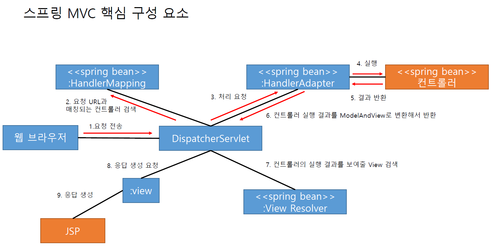

## 스프링 MVC 핵심 구성 요소


* 실제 개발자가 만들어야 할 객체는 컨트롤러와 View에 해당하는 JSP이다.

* 그외에는 스프링이 알아서 동작을 하도록 구동한다.

## DispatcherServlet과 스프링 컨테이너
* web.xml 설정을 보면 DispatcherServlet의 contextConfigLocation 초기화 파라미터를 이용해서 스프링 설정 파일 목록을 전달했다.

* DispatcherServlet는 전달 받은 설정파일을 이용해서 스프링 컨테이너를 생성한다.

* 초기화 파라미터를 설정하지 않는 경우 /WEB-INF/[서블릿 이름]-servlet.xml 파일을 설정파일로 사용한다.

    ```xml
    <!-- web.xml -->
    <servlet>
 		<servlet-name>appServlet</servlet-name>
 		<servlet-class>org.springframework.web.servlet.DispatcherServlet</servlet-class>
 		<init-param>
			<param-name>contextConfigLocation</param-name>
			<param-value>
				classpath:spring-mvc.xml
				classpath:spring-controller.xml
			</param-value>
			<load-on-startup>1</load-on-startup>
		</init-param>
 	</servlet>
 	
 	<servlet-mapping>
		<servlet-name>appServlet</servlet-name>
		<url-pattern>/</url-pattern>
	</servlet-mapping>
    ```

## @Controller를 위한 HandlerMapping과 HandlerAdapter
* DispatcherServlet는 웹 브라우저의 요청을 처리할 핸들러 객체를 찾기 위해
HandlerMapping을 사용한다.

* 그리고 검색된 핸들러 객체를 사용하기 위해 HandlerAdapter객체를 사용한다.

* 위 두 객체를 사용하기 위해 빈 객체로 등록해야 하는데, &lt;mvc:annotation-driven /&gt; 태그가 관련된 모든 객체를 빈 등록 시켜준다.

* 위 두 클래스에 대한 빈 설정도 위 태그로 처리한다.

* RequestMappingHandlerMapping 어노테이션은 @Controller에 적용된 @RequestMapping의 값을 이용해서 웹 브라우저의 요청을 처리할 컨트롤러 빈을 찾는다.

* RequestMappingHandlerAdapter 어노테이션은 컨트롤러의 메서드를 알맞게 실행하고 그 결과를 ModelAndView 객체로 변환해서 DispatcherServlet으로 반환한다.

## JSP를 위한 ViewResolver
* 컨트롤러 처리 결과를 JSP를 이용해서 생성하려면 다음과 같은 설정을 추가해 주면 된다.
    ```xml
    <!-- spring-mvc.xml -->
    <mvc:view-resolvers>
        <mvc:jsp prefix="/WEB-INF/views/" />
    </mvc:view-resolvers>
    <!-- 단 mvc:view-resolvers태그는 스프링 4.1부터 지원한다. -->
    ```

* mvc:jsp 태그는 InternalResourceViewResolver 클래스를 이용해서 다음과 같은 빈을 등록한다.
    ```xml
    <!-- 스프링 4.1이전에는 이와같이 사용했다. -->
    <bean id=“viewReslover” class=“o.s.w.servlet.view. InternalResourceViewResolver”>
        <property name=“prefix” value=“/WEB-INF/views”>
        <property name=“suffix” value=“.jsp”>
    </bean>
    ```

* 컨트롤러의 실행 결과를 받은 DispatcherServlet은 ViewResolver에게 뷰 이름에 해당하는 View 객체를 요청하는데 이때 InternalResourceViewResolver는 prefix+뷰이름+suffix 에 해당하는 경로에 뷰코드로 사용하는 View 객체를 리턴한다.

* DispatcherServlet이 InternalResourceView 객체에 응답 생성을 요청하면
InternalResourceView객체는 지정한 경로의 JSP코드를 실행해서 응답 결과를 생성한다.

* DispatcherServlet는 컨트롤러 실행 결과를 HandlerAdapter을 통해서 ModelAndView 객체 형태로 전달 받는데 이중 Model에 해당하는 값을 View 객체에 Map형식으로 전달한다.

* InternalResourceView는 Map에 담긴 키값을 request.setAttribute()를 통해 request의 속성에 저장한다.

* 결과적으로 Model속성이 request객체의 속성을 통해서 전달되기 때문에 JSP는 모델에 지정한 속성 이름을 통해서 값을 사용할 수 있게 된다.

## 디폴트 핸들러와 HandlerMapping의 우선 순위
* 기본적인 매핑 경로를 다음과 같이 주었다.
    ```xml
    <servlet-mapping>
        <servlet-name>dispatcher</servlet-name>
        <url-pattern>/</url-pattern>
    </servlet-mapping>
    ```

* 매핑 경로가 ‘/’인 경우 .jsp로 끝나는 요청을 제외한 모든 요청을 DispatcherServlet이 처리하게 된다. (/index.html, /css/board.css등)

* 그런 &lt;MVC:annotation-driven&gt;태그를 통해서 등록되는 HandlerMapping은 @Controller 어노테이션이 적용된 빈 객체가 처리할 수 있는 요청 경로만 대응할 수 있다.

* 등록된 컨트롤러가 1개이고 컨트롤러가 @RequestMapping("/hello")만 설정하고 있다면 앞서 본 /index.html이나 /css/board.css같은 요청은 처리할 수 없기 때문에 404에러를 만들게 된다.

* 이런 경로를 처리하기 위해서 직접 컨트롤러 객체를 구현해 줄 수도 있지만
&lt;mvc:default-servlet-handler /&gt; 태그로 사용하는 것이 편하다.

* &lt;mvc:default-servlet-handler /&gt; 태그는 다음 두개의 빈 객체를 추가한다.
  - DefaultServletHttpRequestHandler
  - SimpleUrlHandlerMapping

* DefaultServletHttpRequestHandler는 <span style="color:yellowgreen">클라이언트의 모든 요청을</span> WAS가 제공하는 기본 서블릿에 전달한다.

* 그후에 SimpleUrlHandlerMapping를 이용해서 모든 경로가 DefaultServletHttpRequestHandler를 이용해서 처리하도록 설정한다.

* &lt;mvc:annotation-driven /&gt; 태그가 등록하는 RequestMappingHandlerMapping의 적용 우선 순위가 &lt;mvc:default-servlet-handler /&gt; 가 등록하는 SimpleUrlHandlerMapping보
다 높기 때문에 다음과 같은 방식으로 요청을 처리한다.
  1) RequestMappingHandlerMapping을 사용해서 요청 처리할 핸들러를 검색한다.
  2) 존재하면 해당 컨트롤러를 이용해서 요청을 처리한다.
  3) 존재하지 않으면 SimpleUrlHandlerMapping을 사용해서 요청 처리할 핸들러를 검색한다.
  4) &lt;mvc:default-servlet-handler /&gt;가 등록한 SimpleUrlHandlerMapping는 /**경로(모든 경로)에 대해 DefaultServletHttpRequestHandler를 반환한다.
  5) DispatcherServlet은 DefaultServletHttpRequestHandler에 처리를 요청한다.
  6) DefaultServletHttpRequestHandler는 디폴트 서블릿에 처리를 위임한다.  
  <br>

* SimpleUrlHandlerMapping는 우선 순위가 가장 낮으므로 등록되지 않은 요청은 모두 디폴트서블릿이 처리하게 한다.